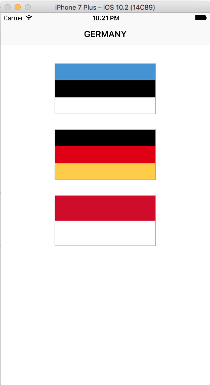
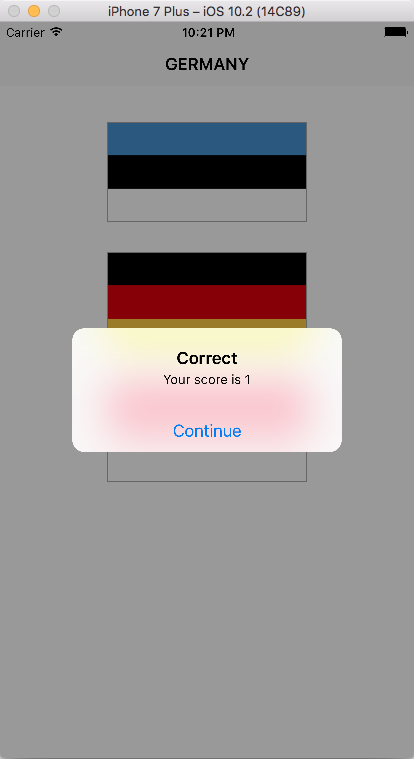
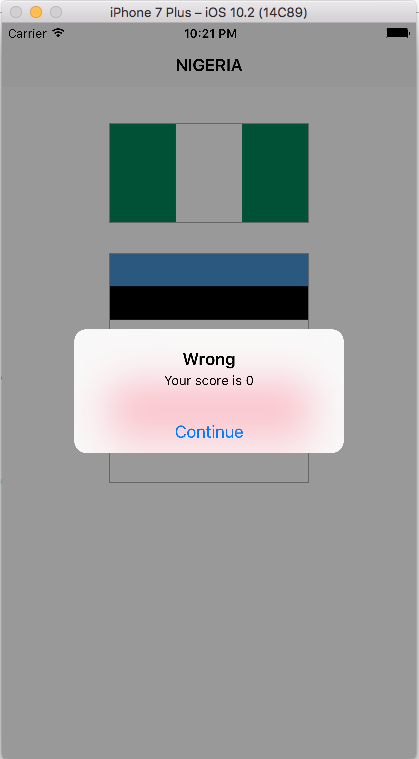

# GuesstheFlag

A basic app that displays images of country flags whereby the user has to tap on the correct flag to score points.

### Screenshots of the Guess the Flag App

                         Above: Screenshot of the "Main" screen in the Guess the Flag app

                         Above: Screenshot of the "Correct Answer" pop-up alert in the Guess the Flag app

                         Above: Screenshot of the "Wrong Answer" pop-up alert in the Guess the Flag app

Code Source: Hacking with Swift - https://www.hackingwithswift.com

